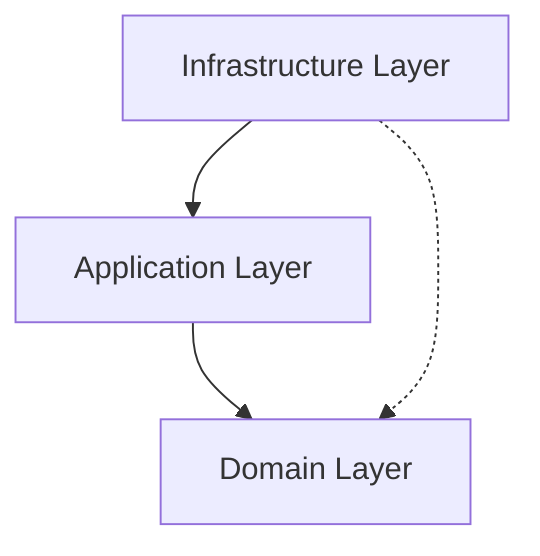
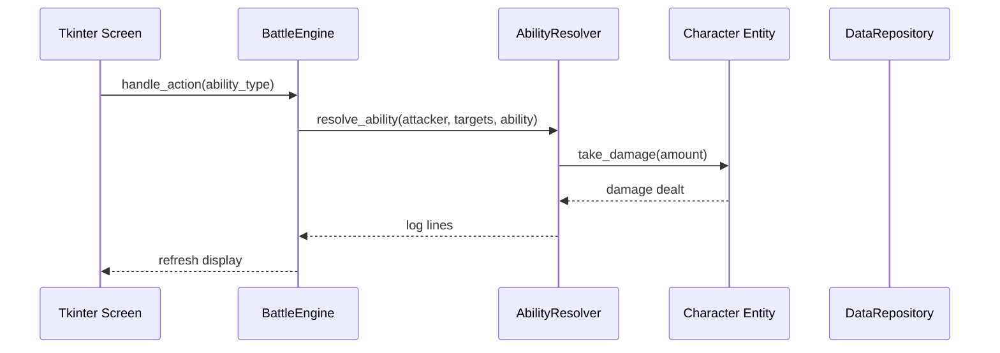

# Architecture

Circle Cycle follows Clean Architecture with dependencies pointing inward. The domain layer contains pure business rules with no framework dependencies.

## Layer Diagram



## Request Flow



## Data Flow

```
User Click → Screen (infrastructure/ui)
  → BattleEngine (application/services)
    → AbilityResolver / CardApplicator (application/services)
      → Character Entity (domain/entities)
        → Status/HP mutation
      ← Log strings returned
    ← Results aggregated
  ← UI refreshed from engine state
```

## Layers

### Domain (Layer 1)
Pure business rules. No imports from infrastructure or application.
- **Entities**: `Character`, `Ability`, `Card` — plain dataclasses with behavior
- **Enums**: `AbilityType`, `CharacterSize`, `StatusEffect`, `CardStat`
- **Interfaces**: `DataRepository` ABC — port for data loading
- **Value Objects**: `CardEffect` — immutable frozen dataclass
- **Exceptions**: `BattleNotStartedError`, `InvalidActionError`, etc.
- **Constants**: `BURN_DAMAGE_PER_STACK`, `TEAM_SIZE`, etc.

### Application (Layer 2)
Orchestration and use cases. Depends only on domain.
- **BattleEngine**: Manages turn order, card phases, win conditions
- **BotAI**: Heuristic-based AI opponent decisions
- **AbilityResolver**: Resolves ability effects against targets
- **CardApplicator**: Applies card buffs to characters

### Infrastructure (Layer 3)
Framework adapters. Implements domain interfaces.
- **JsonDataRepository**: Reads `data/*.json` files, maps to domain entities
- **Tkinter UI**: Screens (Select, Battle, Card), rendering utilities
- **Config**: `Settings` dataclass from environment variables

## Key Decisions

| Decision | Rationale |
|----------|-----------|
| Tkinter | Built-in, zero dependencies, suitable for turn-based games |
| Dataclasses | Lightweight, stdlib, no ORM overhead for a desktop game |
| JSON data files | Simple, human-editable, no database needed |
| Clean Architecture | Testable domain, swappable infrastructure |
| StrEnum | Python 3.12+ feature, serializes naturally to/from JSON strings |
| Frozen dataclasses | Immutable value objects prevent accidental mutation |
